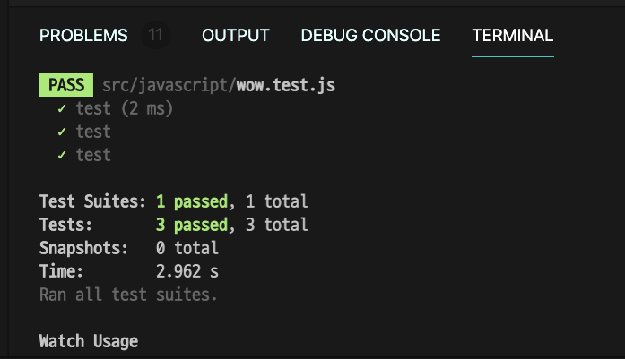

# 코딩 테스트 연습장

<code></code>
<code></code>
<code></code>

## Rules

- 모든 코드에는 테스트 코드가 존재해야한다. (TDD 할 수 있으면 해본다)

- 문제를 풀고 꼭 회고를 한다. (다른 방법으로 해결할 수 있는지, 좋은 코드인지 등)

## 일지

- 2020.09.24 처음 자바스크립트, 파이썬, 자바언어를 다 사용하려고 했는데.. 일단 자바랑 자바스크립트로 작성하자.

## 언어별 안내

### Javascript

테스트 프레임워크 : Jest



#### Required

1. `npm install`를 사용하여 jest설치 및 관련된 노드 패키지 다운로드
2. 최상단 디렉토리에서 `npm test` 명령어를 통해 실시간으로 테스트하기

### Java

테스트 프레임워크 : junit

자바 버전 : Open JDK 14

java test report를 통해서 UI적으로 테스트 결과를 보면서 테스트하기

#### Required

- 처음 저장소를 클론 할 경우, java 디렉토리 위치에서 `mvn install`을 실행하여 의존성 다운받기
- `maven`이 설치 되어있어야함, maven이 설치되어있는지 `mvn --version` 으로 확인 할 것

## Tip

```java
// Integer to int
Arrays.stream(a).mapToInt(Integer::intValue).toArray();
```

```java
// List 정렬하기
List<Integer> data = new ArrayList<>();

Collections.sort(data);
```
